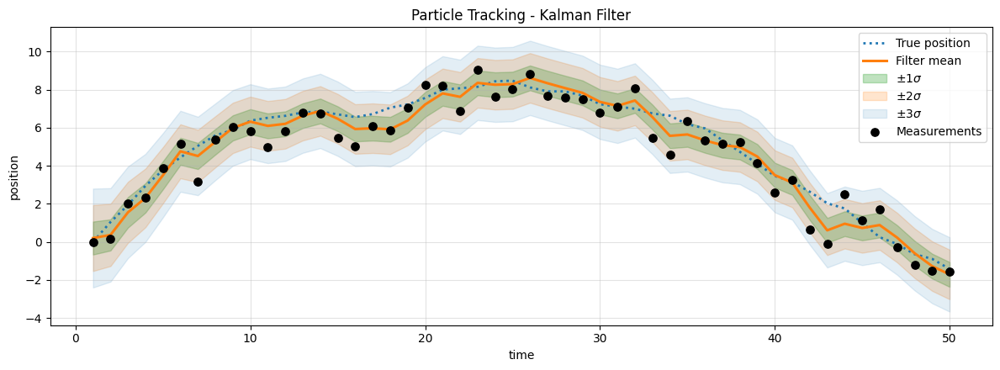
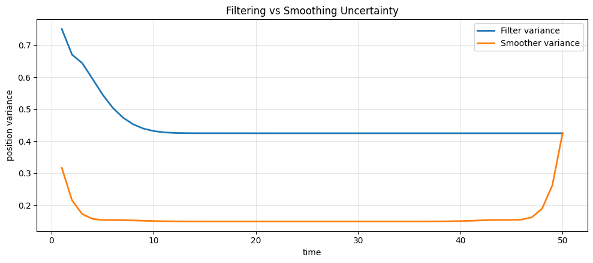
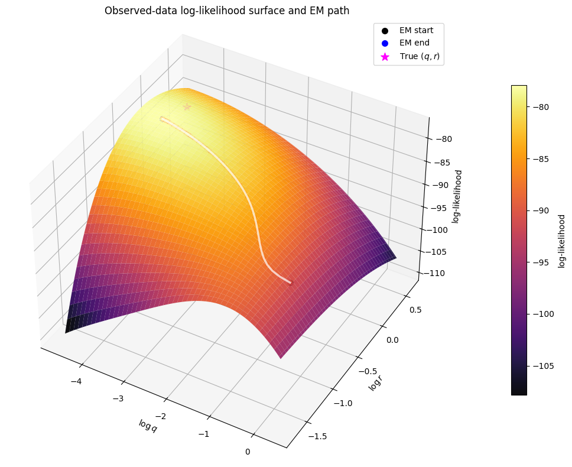
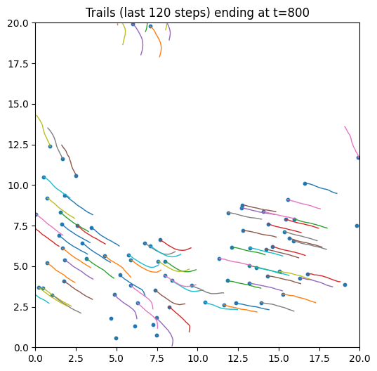
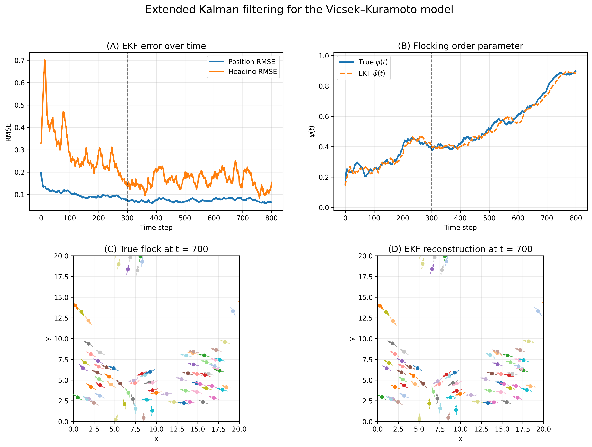
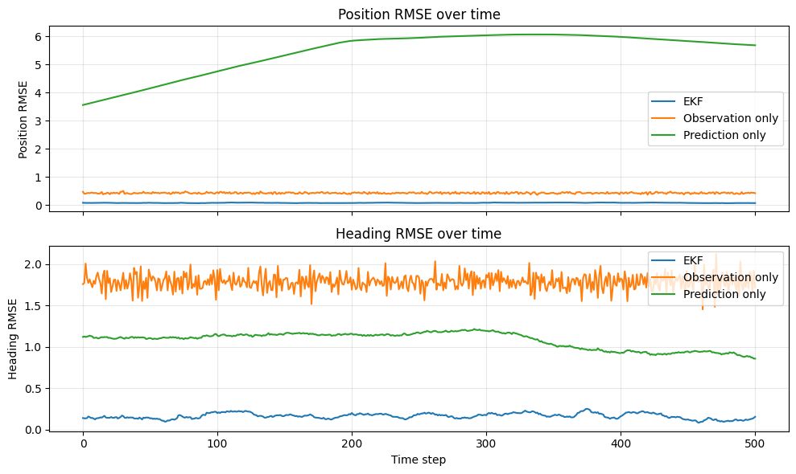

# Kalman Filter Project

This repository holds the code and figures for my MSci dissertation at the University of Bristol,
supervised by Dr Sam Power. The project builds up filtering and parameter estimation for state space
models, and then applies that machinery to a nonlinear model of collective motion.

The work comes in two halves. The first is the linear Gaussian setting, where the Kalman filter, the
Kalman smoother and an EM algorithm for the unknown noise covariances can all be written down in
closed form. The second is the Vicsek Kuramoto model, an interacting particle system in which agents
turn to align with their neighbours. There the transition map is nonlinear, the filtering
distribution is no longer Gaussian, and an Extended Kalman Filter is used instead.

Every notebook is stored together with its outputs, so the figures and printed results can be read
on GitHub without running anything.

## Reading order

The notebooks live in `report/notebooks` and are numbered in the order they are meant to be read.

* `01_kalman_filter.ipynb` sets up the Kalman filter, then tracks a one dimensional particle under a
  constant velocity model, looks at what the initial covariance does to the early estimates, and
  draws covariance ellipses in two and three dimensions.
* `02_kalman_smoother.ipynb` adds the backward smoothing recursion and compares it against the
  filter, both in trajectory error and in uncertainty.
* `03_expectation_maximisation.ipynb` estimates the process and observation noise with EM on the same
  constant velocity data, and uses the observed data log likelihood surface as a check on where EM
  ends up.
* `04_extended_kalman_filter_example.ipynb` is a first look at linearising a nonlinear model.
* `05_vicsek_kuramoto_simulator.ipynb` contains the simulator, snapshots of the flock at several
  times, and trail plots.
* `06_state_space_model.ipynb` covers the state conversion, the observation model, and the
  interaction matrix built from a hard radius neighbourhood rule.
* `07_smooth_interaction_surrogate.ipynb` replaces that discontinuous rule with a smooth Gaussian
  surrogate so the transition map is differentiable, and derives the Jacobian.
* `08_vkssm_extended_kalman_filter.ipynb` runs the Extended Kalman Filter for the Vicsek Kuramoto
  state space model against simulated truth.
* `09_diagnostics_and_baselines.ipynb` has the RMSE diagnostics, the flocking order parameter, and
  the comparison against the observation only and prediction only baselines.
* `10_animations.ipynb` holds the two animations. This one is large, because the animation is
  embedded in the notebook itself, so GitHub will not preview it. The same material sits in
  `report/videos` as mp4 files.

The two original combined notebooks are still here as `report/code.ipynb` and
`report/kf_ks_em.ipynb`. Nothing was removed when they were split. The cells were copied across
unchanged, outputs included.

## Simulation settings

The runs shown below use 80 agents over 800 steps on a periodic square of side 20, with speed 0.35,
time step 0.05, alignment strength 3.0, interaction radius 1.5 and angular noise 0.25. The
interaction graph is rebuilt at every step with binary weights, and the seed is fixed at 42.

## The linear Gaussian case

A particle moving under a constant velocity model, observed with noise. The filter mean follows the
true position, and the shaded bands are one, two and three standard deviations of the filtering
distribution.

Position variance over time for the filter and the smoother. The filter settles onto a steady value
once it has seen enough data. The smoother sits lower everywhere, because it conditions on the whole
record rather than only the past, and it rises at the two ends where there is data on one side only.

The observed data log likelihood as a function of the process and observation noise, with the path
EM takes across the surface and the true parameter values marked.

## Collective motion

Trails over the final 120 steps of the simulation. Neighbouring agents share a heading, which is the
alignment the model is built to produce.

The main result. Panel A gives position and heading RMSE over time. Panel B puts the true flocking
order parameter next to the EKF estimate of it. Panels C and D show the true flock and the EKF
reconstruction at step 700, from noisy position observations alone.

The EKF against two baselines. Reading positions straight off the noisy observations recovers
nothing useful about heading, and propagating the dynamics forward without ever correcting on an
observation drifts steadily in position. The EKF stays below both throughout.

## Animations

`report/videos` holds three mp4 files: the simulation on its own, the flocking demo, and the demo
using the smooth surrogate. There is an interactive version at
https://y-oth.github.io/vicsek_visualiser/.

## Other figures

`report/plots` contains further figures that are not shown above, including the geometry of the
alignment term, the exponential kernel overlay, the three dimensional views of the filter, and the
path EM traces through parameter space.
